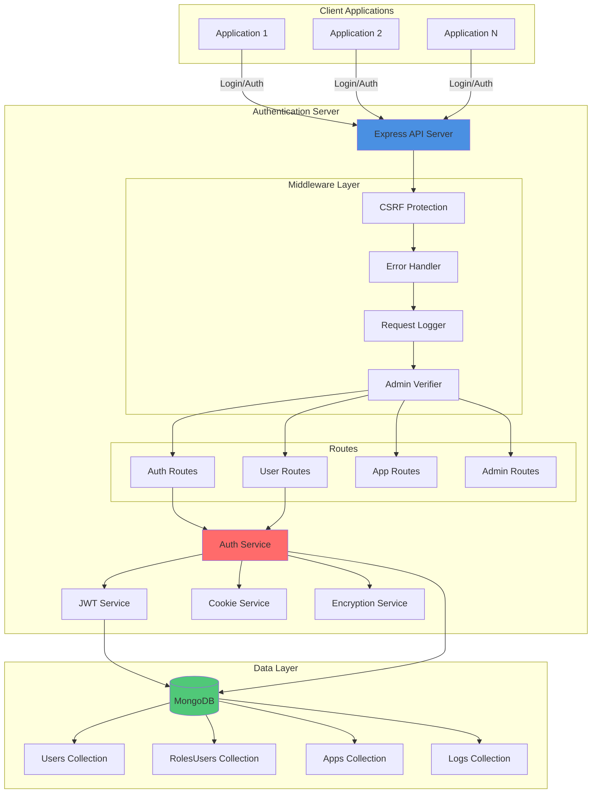
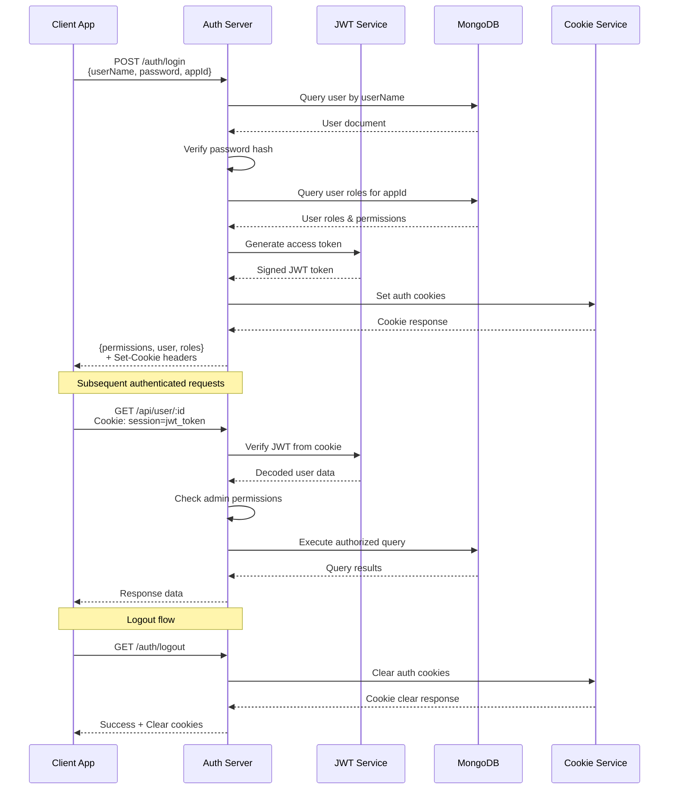

# TypeScript User Authentication Server

A centralized authentication and authorization server built with Node.js, TypeScript, and MongoDB. Provides JWT-based authentication, role-based access control (RBAC), and secure session management for multiple applications.

Built in March 2019 and enhanced with modern security practices. This server acts as a central authentication hub, managing users, roles, and permissions across multiple connected applications.

## Features

- 🔐 JWT-based authentication with secure cookie management
- 👥 User management with encrypted password storage
- 🎭 Role-based access control (RBAC) across multiple applications
- 🔑 Secure session management with access and refresh tokens
- 🛡️ Built-in security middleware (CSRF protection, Helmet, CORS)
- 📊 Comprehensive logging (console, file, database, remote server)
- 🗄️ MongoDB integration for data persistence
- 🔧 PM2 process management support
- 🚀 RESTful API with Express.js
- 📝 TypeScript for type safety

## Architecture



## System Flow



## Getting Started

### Prerequisites

- Node.js (v12 or higher)
- MongoDB (v3.1 or higher)
- npm or yarn
- PM2 (optional, for production deployment)

### Installation

1. Clone the repository:
```bash
git clone https://github.com/orassayag/typescript-user-authentication-server.git
cd typescript-user-authentication-server
```

2. Install dependencies:
```bash
npm install
```

3. Install PM2 globally (recommended for production):
```bash
sudo npm install -g pm2
```

### Configuration

1. Set up environment variables (create a `.env` file):
```bash
ENV=development
PORT=5111
MONGO_CONNSTRING=mongodb://localhost:27017
MONGO_DATABASE_UA=UA_DB_Dev
MONGO_DATABASE_LOGS=UA_Logs_Dev
```

2. Edit `config.ts` to customize:
   - JWT encryption keys (**⚠️ Change in production!**)
   - Cookie expiration times
   - Logging configuration
   - Database settings

### Running the Server

#### Development Mode
```bash
npm run dev
```

#### Production Mode with PM2
```bash
pm2 start node --name UATool server
```

**PM2 Commands:**
```bash
pm2 status                 # Check server status
pm2 logs                   # View logs in real-time
pm2 restart UATool         # Restart the server
pm2 stop UATool            # Stop the server
```

For detailed instructions, see [INSTRUCTIONS.md](INSTRUCTIONS.md).

## API Endpoints

### Authentication

| Method | Endpoint | Description |
|--------|----------|-------------|
| `GET` | `/auth/permissions/:appId` | Get user permissions for app |
| `POST` | `/auth/login` | Login and get JWT tokens |
| `GET` | `/auth/logout` | Logout and clear session |

### User Management (Admin only)

| Method | Endpoint | Description |
|--------|----------|-------------|
| `GET` | `/api/user/` | Get all users |
| `POST` | `/api/user/` | Create new user |
| `PUT` | `/api/user/:userId` | Update user |
| `DELETE` | `/api/user/:userId` | Delete user |
| `POST` | `/api/user/:userId/app-roles` | Assign roles to user |
| `DELETE` | `/api/user/:userId/app/:appId/role/:roleId` | Remove role from user |

### Application Management (Admin only)

| Method | Endpoint | Description |
|--------|----------|-------------|
| `GET` | `/api/app/` | Get all applications |
| `POST` | `/api/app/` | Create application |
| `PUT` | `/api/app/:appId` | Update application |
| `DELETE` | `/api/app/:appId` | Delete application |

### Monitoring & Development

| Method | Endpoint | Description |
|--------|----------|-------------|
| `GET` | `/ping` | Server health check |
| `GET` | `/log/incoming` | View incoming requests |
| `GET` | `/log/requests` | View request/response details |
| `GET` | `/log/errors` | View error logs |

## Project Structure

```
typescript-user-authentication-server/
├── src/
│   ├── app.ts                      # Main application class
│   ├── server.ts                   # Server entry point
│   ├── config.ts                   # Configuration file
│   ├── routes/                     # API route definitions
│   │   ├── auth.routes.ts          # Authentication routes
│   │   ├── user.routes.ts          # User management routes
│   │   ├── app.routes.ts           # Application routes
│   │   ├── admin.routes.ts         # Admin routes
│   │   └── test.routes.ts          # Test routes (dev only)
│   ├── services/                   # Business logic services
│   │   ├── ua-server-auth.service.ts
│   │   └── encryption.service.ts
│   ├── middlewares/                # Express middleware
│   │   ├── verify-user-is-admin.middleware.ts
│   │   ├── verify-req-from-server.middleware.ts
│   │   └── is-admin-of-app.middleware.ts
│   ├── models/                     # Data models
│   │   └── permissions-response.model.ts
│   └── shared/                     # Shared components
│       ├── base-server.ts          # Base server class
│       ├── base-app.ts             # Base application class
│       ├── routes/                 # Base route classes
│       ├── services/               # Core services
│       │   ├── auth.service.ts
│       │   ├── db.service.ts
│       │   ├── jwt.service.ts
│       │   ├── cookie.service.ts
│       │   ├── http.service.ts
│       │   ├── file.service.ts
│       │   ├── response.service.ts
│       │   ├── sanitation.service.ts
│       │   └── logging/            # Logging services
│       ├── middlewares/            # Core middleware
│       │   ├── base.middleware.ts
│       │   ├── csrf-token.middleware.ts
│       │   ├── error-handler.middleware.ts
│       │   ├── log-request.middleware.ts
│       │   └── response-headers.middleware.ts
│       ├── models/                 # Core models
│       ├── consts/                 # Constants
│       └── utils/                  # Utility functions
├── logs/                           # Log files (generated)
└── package.json
```

## Database Collections

### Users
Stores user account information:
```typescript
{
  _id: number,              // Auto-increment user ID
  userName: string,         // Unique username
  password: string,         // Hashed password
  firstName: string,        // User's first name
  lastName: string,         // User's last name
  isActive: boolean         // Account status
}
```

### RolesUsers
Maps users to roles for specific applications:
```typescript
{
  userId: number,           // Reference to Users._id
  appId: string,            // Application identifier
  roleId: string,           // Role identifier
  isActive: boolean         // Role assignment status
}
```

### Apps
Registered applications and their roles:
```typescript
{
  _id: string,              // Application ID
  name: string,             // Application name
  isActive: boolean,        // Application status
  roles: {                  // Role definitions
    [roleId: string]: {
      name: string,
      isActive: boolean
    }
  }
}
```

## Security Features

### Authentication & Authorization
- JWT tokens with configurable expiration
- Secure password hashing with encryption service
- Role-based access control (RBAC)
- Session management with access and refresh tokens

### Security Middleware
- **Helmet**: Sets security-related HTTP headers
- **CORS**: Cross-origin resource sharing protection
- **CSRF**: Cross-site request forgery protection
- **Input Sanitation**: Validates and sanitizes user inputs

### Logging & Monitoring
- Request/response logging
- Error tracking with stack traces
- Multiple logging appenders (console, file, database, remote server)
- Configurable logging levels per environment

## Development

### Building TypeScript
```bash
npm run compile-to-js
```

### Watch Mode (Auto-compile)
```bash
npm run watch
```

### Debug Mode
```bash
npm run debug
```
Then attach your debugger to the Node.js process.

## Contributing

Contributions are welcome! Please read [CONTRIBUTING.md](CONTRIBUTING.md) for guidelines on how to contribute to this project.

Key areas for contribution:
- Security enhancements
- Additional authentication methods (OAuth, SAML)
- Improved logging and monitoring
- Performance optimizations
- Documentation improvements

## Author

* **Or Assayag** - *Initial work* - [orassayag](https://github.com/orassayag)
* Or Assayag <orassayag@gmail.com>
* GitHub: https://github.com/orassayag
* StackOverflow: https://stackoverflow.com/users/4442606/or-assayag?tab=profile
* LinkedIn: https://linkedin.com/in/orassayag

## License

This project is licensed under the MIT License - see the [LICENSE](LICENSE) file for details.

## Acknowledgments

- Built with [Express.js](https://expressjs.com/)
- Uses [jsonwebtoken](https://github.com/auth0/node-jsonwebtoken) for JWT handling
- Powered by [MongoDB](https://www.mongodb.com/)
- Process management with [PM2](https://pm2.keymetrics.io/)
